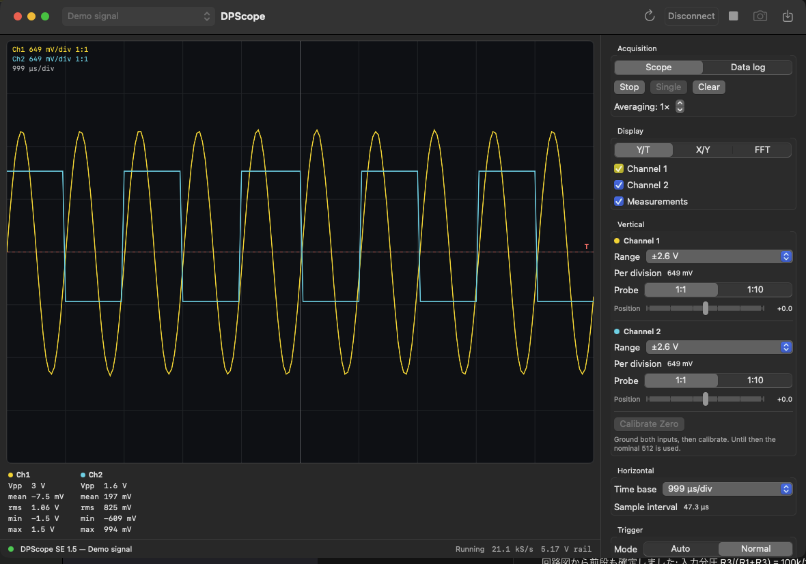

# PCBScope / DPScope SE for macOS

Restored from this repository's `0f8ba4d` revision, before the Pico 2 PiLyzer
rewrite. This is the native HID application for PCBScope / DPScope SE hardware;
it is independent of the Pico 2 vendor-bulk USB instrument in `../Pico2`.
The Swift targets and application bundle keep their original DPScope names.

A native macOS application for the [DPScope SE](https://dpscope.freevar.com/overview_se.html)
USB oscilloscope, written in Swift and SwiftUI.

The DPScope SE only ever shipped with Windows software. It is a PIC18F14K50
that enumerates as a vendor-defined USB HID device, so this app talks to it
directly — no drivers, no serial port, no Python.



*Above: the app running against its built-in signal generator, so the window
looks the same with no hardware attached.*

## Requirements

* macOS 13 or later
* Xcode 16 or later (Swift 6 toolchain) to build
* A DPScope SE. No driver or permission is needed — the scope is a
  vendor-usage HID device and macOS hands it over on request.

## Building and running

Build a double-clickable, ad-hoc signed application bundle:

```bash
./Scripts/make-app.sh
```

It lands in `build/DPScope.app`. To run straight from the package instead:

```bash
swift run DPScope
```

There is a built-in signal generator, so the app is fully usable with no
hardware attached — pick **Demo signal** in the toolbar, or launch with:

```bash
swift run DPScope --demo
```

`--autostart` connects to the remembered instrument and starts sweeping.

Tests:

```bash
swift test
```

Three of them drive a real scope and are skipped automatically when none is
plugged in.

## Using it

1. Pick the scope (or **Demo signal**) in the toolbar and press **Connect**
   (⌘K). The app checks the firmware identity, so nothing else on the USB bus
   can be mistaken for a scope. The list follows the hardware as it is plugged
   and unplugged, and switching the picker while connected moves to the other
   instrument. **Demo signal** is the built-in generator — a 1 kHz sine on Ch1
   and a 500 Hz square on Ch2 — not anything on your probes.
2. Press **Run** (⌘R) for continuous sweeps, or **Single** (⇧⌘S) for one.
3. **Export** (⌘E) writes the trace on screen to CSV.

| Section | Controls |
| --- | --- |
| Acquisition | Scope / data-log mode, run, single, clear, 1–100× averaging |
| Display | Y/T, X/Y and FFT views, channel and readout visibility |
| Vertical | Six ranges from ±26 V to ±0.65 V per channel, 1:1 or 1:10 probe, screen position, zero calibration |
| Horizontal | 10 µs/div – 1 s/div, with equivalent-time sampling above the converter's real-time limit |
| Trigger | Auto or normal, Ch1 or the external trigger pin, rising or falling edge, level |

**Auto** still triggers whenever it can — that is what holds a repetitive signal
still on screen — and sweeps free only when nothing crosses the threshold within
80 ms. **Normal** waits indefinitely and reports when no trigger arrives. The
fastest sweeps use equivalent-time sampling, which builds one record from many
trigger events, so those always trigger whatever the mode says.

A channel whose samples reach the converter's limits is marked **CLIP**: the
trace on screen is a flattened copy of the real signal, and no software
calibration can recover it. On the ×10 ranges this usually means the board's
offset trimmer for that channel needs adjusting.

Readouts under the screen show Vpp, mean, RMS, min and max per channel, and
the front panel comes back the way you left it next launch.

### Calibrate the zero point

Every reading is referenced to the converter code that means 0 V. The board's
offset trimmers set that point, and the ×10 amplifier multiplies whatever error
they leave, so the finer ranges are only as good as this calibration:

1. Ground both inputs.
2. Stop the sweep and press **Calibrate Zero** (also in the Scope menu).

The app measures both amplifier paths on both channels and stores the four
codes. Until then it uses the nominal 512 from the vendor's documentation.

The supply rail is measured automatically at connect through the PIC's 4.096 V
reference, and every volt on screen is scaled by it; **Measure Supply Rail**
repeats that measurement.

## How it is put together

| Target | Contents |
| --- | --- |
| `Sources/DPScopeCore` | HID transport, the SE command set, the simulated scope, unit conversion, FFT, and the acquisition engine |
| `Sources/DPScopeApp` | SwiftUI front panel, scope display, CSV export |
| `Tests/DPScopeCoreTests` | Command encoding, scaling, spectrum, engine tests against the simulator, and hardware tests |

`DPScopeCore` has no UI dependencies, and the real instrument and the simulator
both implement `ScopeDevice`, so the whole acquisition path is exercised by the
test suite without hardware.

Device traffic runs on one background queue and HID input reports are collected
on a private run loop thread, so neither blocks the UI.

Run only one program against a scope at a time. The app asks to seize the
device, but macOS lets another process seize it away, and two clients then
receive each other's replies. Every acknowledged command checks that the scope
echoed the right opcode, so a collision surfaces as a protocol error rather than
as plausible-looking data.

## The instrument's interface

Most of this comes from the vendor's
[DPScope SE Programming Interface Description V1.0.0](https://dpscope.freevar.com/files/DPScope_SE_Interface_Description.pdf)
and the [V1.1 schematic](https://dpscope.freevar.com/files/DPScope_SE_V1_1_schematic.pdf).
The document leaves `CMD_READBACK` blank, and the schematic does not spell out
the channel map, so those were measured on hardware.

* **Connection.** VID `0x04D8`, PID `0xF891`, 64-byte reports, one exchange per
  command. Byte 0 of a command is the opcode; the answer usually starts with the
  same opcode as an acknowledge, though `CMD_REVISION`, `CMD_DONE`,
  `CMD_READADC`, `CMD_READ_LA` and `CMD_READBACK` answer with data only.
* **`CMD_READBACK` (8)** takes a block index and returns 64 bytes: 32 sample
  pairs, channel 1 and channel 2 interleaved, with no acknowledge byte.
* **The record is 211 sample pairs** — six full blocks plus 19 pairs in the
  seventh, after which the buffer holds stale bytes. Timing the acquisition
  agrees: a linear fit over four prescaler/preload combinations gives 423.06
  conversions per record (2 × 211.5) with 4 ms of command overhead.
* **Sample interval** is `2 × (65536 − preload) × prescaler ÷ 12 MHz` **plus a
  fixed 9.8 µs**. Timer0 paces individual conversions and the scope alternates
  channels, so a sample pair costs two timer periods — but the converter's own
  acquisition and conversion time is not covered by the timer, and it adds a
  constant on top. Calibrated by feeding known 220 Hz and 311 Hz square waves
  into both inputs and measuring them back: over timer periods from 20 µs to
  2 ms every sweep ran long by the same 9.80 µs (sd 0.42 µs, n = 35), with no
  dependence on the timer period. With the constant applied, 28 measurements
  spanning both channels and the whole range read back within 0.12% of the true
  frequency on average (worst 0.62%); without it the time axis is wrong by a
  third at the fastest sweeps and still 5% at 200 µs. The constant should track
  ADCON2, so changing the converter timing means re-measuring it.
* **Digital gain** is `sample = (raw10 − 2 × subtract) >> shift`. The documented
  `(shift, subtract)` pairs `(2, 0)`, `(1, 128)` and `(0, 192)` all keep 0 V at
  code 128 under this form, and only under this form — `(0, 192)` measured 187
  where the raw reading was 571.
* **ADC channels.** AN5 = Ch1 ×1, AN6 = Ch1 ×10, AN7 = external trigger,
  AN8 = Ch2 ×1, AN9 = Ch2 ×10, AN15 = the 4.096 V reference. Confirmed by
  reading every channel: the ×10 readings track the ×1 readings amplified about
  ten-fold, and the comparator inputs C12IN1-/2-/3- line up with the trigger
  channel numbers the ARM command takes.
* **Front end.** The input divider is R3 / (R1 + R3) = 100 kΩ / 1009 kΩ, and the
  second stage is 1 + R7 / (R4 ∥ R6) = 1 + 4.53 kΩ / 500 Ω = 10.06. So the ×1
  path spans about ±26 V and the ×10 path — almost exactly 1:1 at the converter
  — about ±2.6 V.

Not implemented: `CMD_ARM_LA`, the logic analyzer's own acquisition mode, which
is the other section the vendor's document leaves blank. The four logic inputs
can still be read one state at a time with `CMD_READ_LA`.

## A test signal

`tools/pico2-signal-generator/sine440.py` is a MicroPython module for a
Raspberry Pi Pico 2 that puts a sine on GPIO 26, for checking the scope against
a known signal. The RP2350 has no DAC, so it modulates a PWM carrier with a sine
table fed by DMA and paced by the PWM's own wrap signal — the timing is entirely
hardware, with no interrupt or Python loop in the path. Add an RC low-pass
(1 kΩ + 100 nF) on the pin to turn the 113 kHz carrier back into a sine.

```python
import sine440
gen = sine440.start()        # 439.893 Hz — as close to 440 as 150 MHz divides
gen = sine440.start(1000)
gen.stop()
```

`tools/pico2-chord/` is the C++ version for the same board: eight square waves —
a chord over two octaves — on GPIO 1, 3, 5, 7, 9, 11, 13, 15, accurate to
within 7 ppm and needing no filter at all. Change `kChord` and `kSemitones` at
the top of `chord.cpp` to play something else. It is what the timing constant
above was measured with.

Either output swings the full 0–3.3 V rail, so measure it on the ±6.5 V range or
coarser; ±2.6 V would clip the peaks.

## Where this came from

It started as a rewrite of Pepijn de Vos's
[DPScope](https://github.com/pepijndevos/DPScope), a Python 2 / Tkinter /
matplotlib program for the *original* DPScope. That is a different instrument:
an FTDI serial port at 500 kbaud with an unrelated command set. None of its code
survives here — the SE speaks USB HID and needed a driver of its own — but it is
where this project began, and it is worth a look if you have the older scope.

## License

MIT. See [LICENSE](LICENSE).
